# Lab1 2D Drawing

## Task 1: Image Dithering

### Uniform Random

使用C++的模板类`uniform_real_distribution<float>`生成均匀分布的随机数，并与原始图片相加。threshold设为0.5。输出如下：

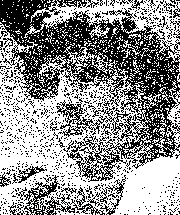

### Blue Noise Random

直接将`input`和`noise`相加即可，threshold设为1.0。输出如下：

### Ordered

在[0, 1)中每间隔1/9设置9个threshold，当`input`在某像素处颜色的值大于第i个threshold时，便将`output`中与该像素对应的3x3区域内，与i相对应的像素颜色置为1。输出如下：

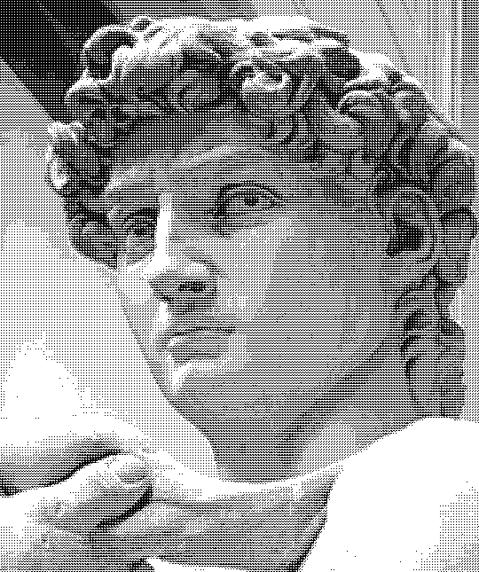

### Error Diffuse

对每个像素，若其`color`值大于0.5，定义其`val`为1，否则为0。记`err = color - val`，将`err`乘以对应权重加到相应邻近像素上。

需要从左到右，从上到下遍历像素，故外循环改变y，内循环改变x。

输出如下：

## Task 2: Image Filtering

### Blur

使用3x3的Uniform Kernel与图像做卷积，效果如下：

### Edge

使用x和y方向的Sobel Edge Detector与图像做卷积，将得到的两个结果平方相加，效果如下：

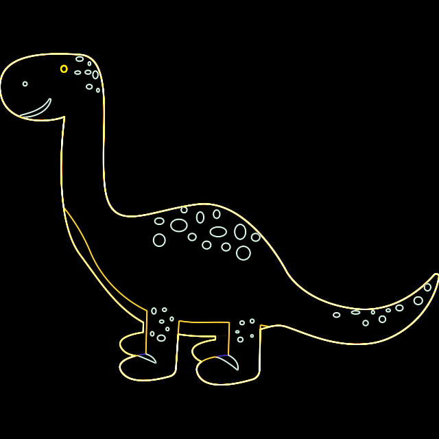

## Task 3: Image Inpainting

用迭代解方程边界条件的初值为背景与前景之差。效果如下：

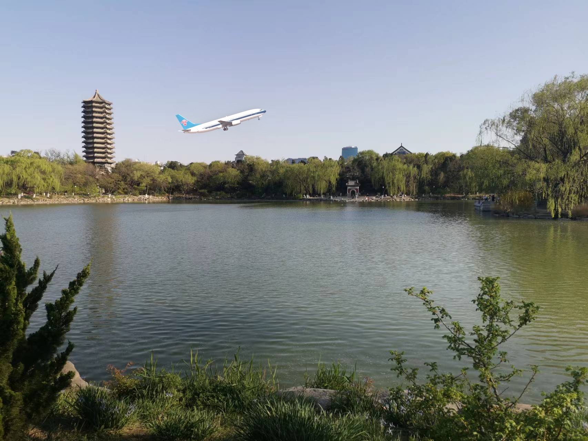

## Task 4: Line Drawing

用Bresenham算法。代码中通过以下方法将8个方向简化为2个：

1) 以斜率的绝对值代替斜率，并用变量`sign`表示每次`y`（若斜率绝对值大于1，则为`x`）须加一还是减一；
2) 通过min和max确定绘图的起点和终点。

不同斜率效果如下：

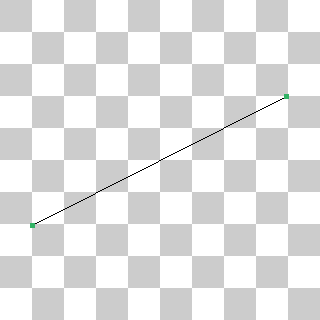

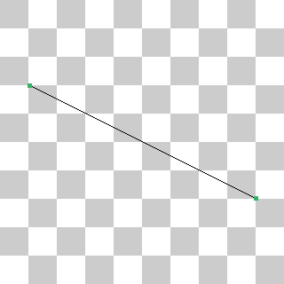

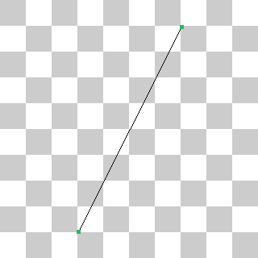

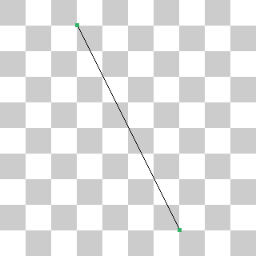

## Task 5: Triangle Drawing

基本思想为[Triangle Sweep-Line Algorithm](https://www.cs.princeton.edu/courses/archive/fall00/cs426/lectures/scan/sld013.htm) ，首先将三角形拆分成两个平底三角形，再进行绘制。效果如下：

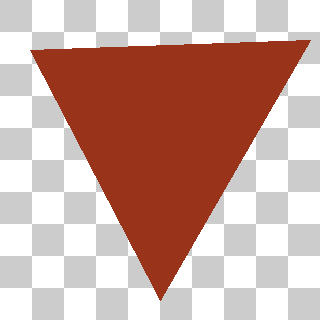

## Task 6: Image Supersampling

计算`input`和`output`的缩放比例，将`output`中的每一个像素对应到`input`中相应的区域，并根据`rate`值进行采样求均值，得到`output`在该像素处的颜色。

`rate=1`（即直接降采）效果如下：

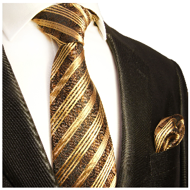

`rate=5`效果如下：

`rate=10`效果如下：

## Task 7: Bezier Curve

用递归实现de Casteljau算法，若传入的点个数n>2，则将相邻两点线性插值，将得到的n-1个点作为新的参数传入函数。四个控制点（包括起止点）的结果如下：

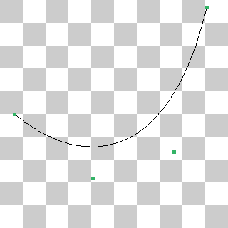
