# Lab 2 Geometry Processing

## Task 1: Loop Mesh Subdivision

**Step 1** 遍历原有的点，计算新的点的坐标$\displaystyle\sum_{Neighbours}up_i + (1-nu)p_0$，并加入到新的mesh中

**Step 2** 遍历所有的半边，计算该边所对应的新点的坐标$\cfrac{3}{8}(p_{from}+p_{to})+\cfrac{1}{8}(p_{opposite_1}+p_{opesite_2})$，并加入到新的mesh中；对于没有PairEdge的半边，新点的坐标采用$\cfrac{1}{2}(p_{from}+p_{to})$。

**Step 3** 遍历所有的面，确定该面上对应的六个点所确定的新的四个三角形，并加入新的mesh中。

函数中使用`map<pair<uint32_t,uint32_t>, uint32_t>`实现利用边检索其对应顶点的存储位置的功能。

函数实现的效果如下（`block.obj`迭代两次）：

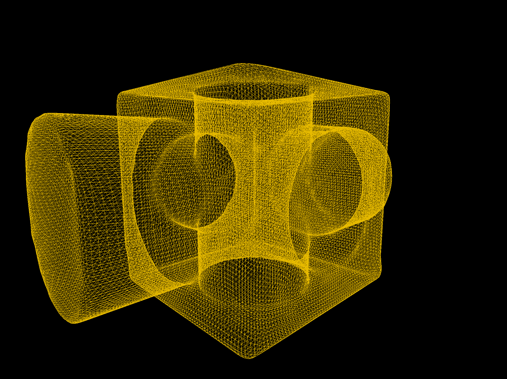

## Task 2: Spring-Mass Mesh Parameterization

**Step 1** 找出一个边界点，并依次序访问与之相邻的其他边界点，将其$(u,v)$坐标初始化为$[0,1]^2$正方形或圆形边界上的点（采用均匀分布），其余各点的$(u,v)$坐标初始化为$(0.5,0.5)$。

**Step 2** 用Jacobi迭代解方程，遍历非边界点，其新坐标$p_{new} = \displaystyle\sum_{j\in Neighbours}\lambda_{ij}p_j = \sum_{Neighbours}p_j/\#\{Neighours\}$。将该过程循环`iteration`次。

函数实现的效果如下。

正方形边界，迭代30次。

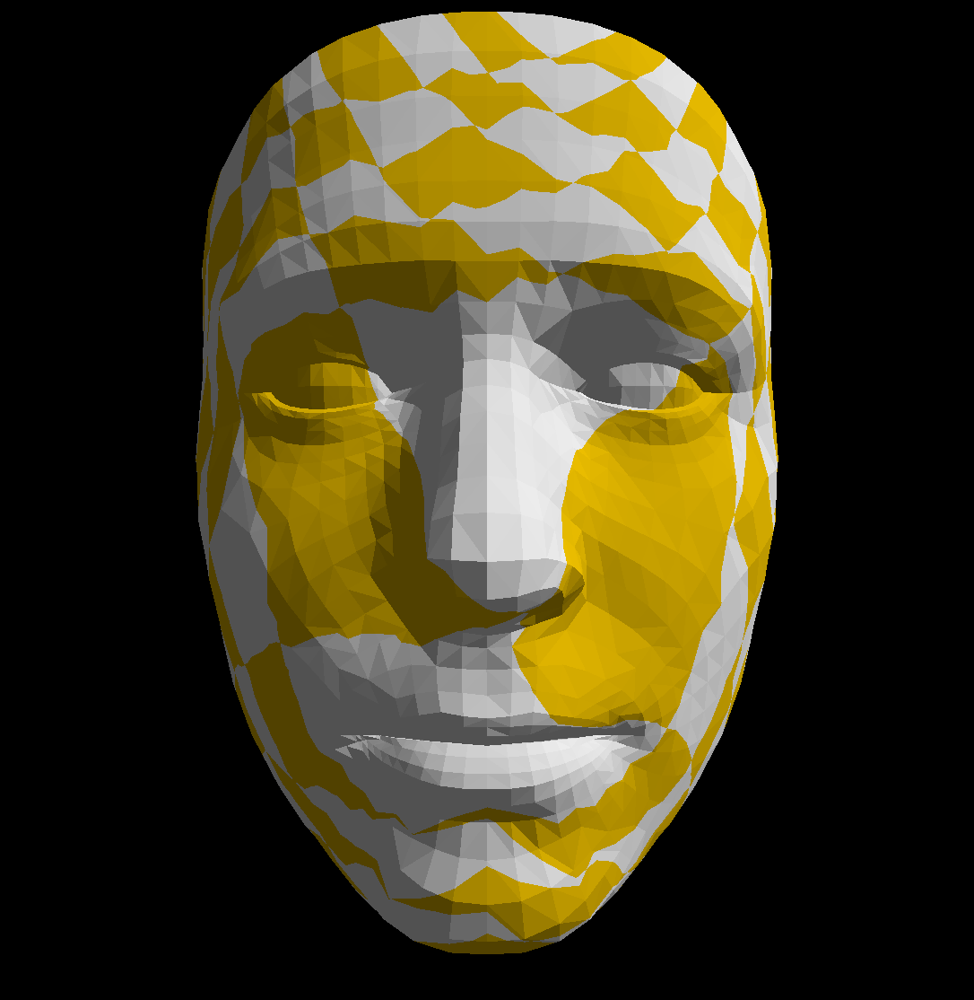

正方形边界，迭代500次。

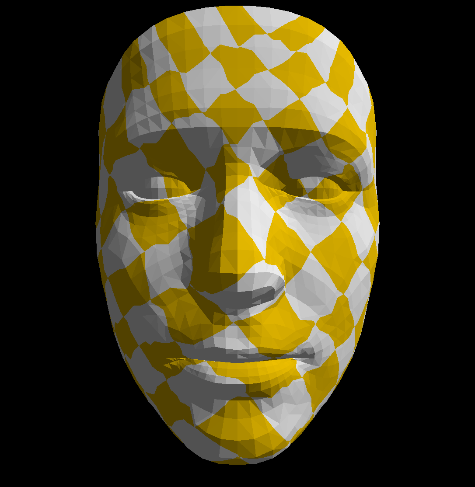

圆形边界，迭代1000次。

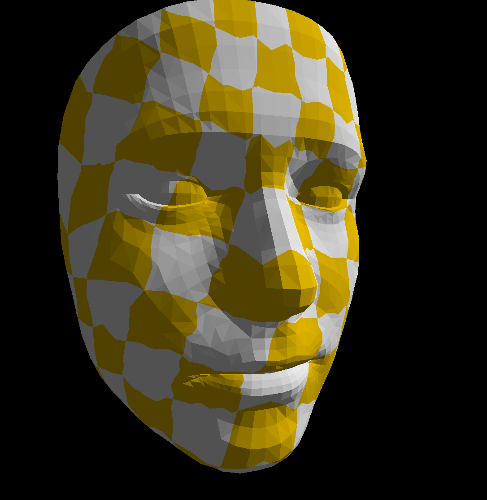

## Task 3: Mesh Simplification

**Step 1** 对每个顶点计算$Q=\displaystyle\sum_{planes}K_p=\sum_{planes}pp^{\mathrm{T}}(p=[a,b,c,d])$，遍历该顶点所在的所有面，计算面的法向量$norm = (p_0-p_1)\times(p_0-p_2)$，单位化后的$norm$即为平面方程$ax+by+cz+d=0(a^2+b^2+c^2=1)$中的系数$a,b,c$，任取一个点代入即可得$d$。

**Step 2** 先遍历每条边，再遍历每个顶点对，选出所有符合要求的顶点。使用`unordered_set`进行检查，防止所选的顶点对重复。

**Step 3** 对每个顶点对，计算求解最优的收缩点$\bar{v}$和代价$\bar{v}^T(Q_i+Q_j)\bar{v}$。

当$\bar{Q} = Q_i+Q_j$不可逆时，考虑取$\bar{v}$在线段$v_iv_j$上，即取$\lambda = \displaystyle\arg\min_{\lambda\in [0,1]}(\lambda v_i+(1-\lambda)v_j)^\mathrm{T}\bar{Q}(\lambda v_i+(1-\lambda)v_j)$，并使$\bar{v} = \lambda v_i+(1-\lambda)v_j$。

**Step 4** 迭代找出代价最小的点对并进行合并，使用并查集实现合并节点等价类。

函数实现的效果如下（`dinosaur.obj`，`Simplify`设置为4，不使用`Distance Threshold`）。

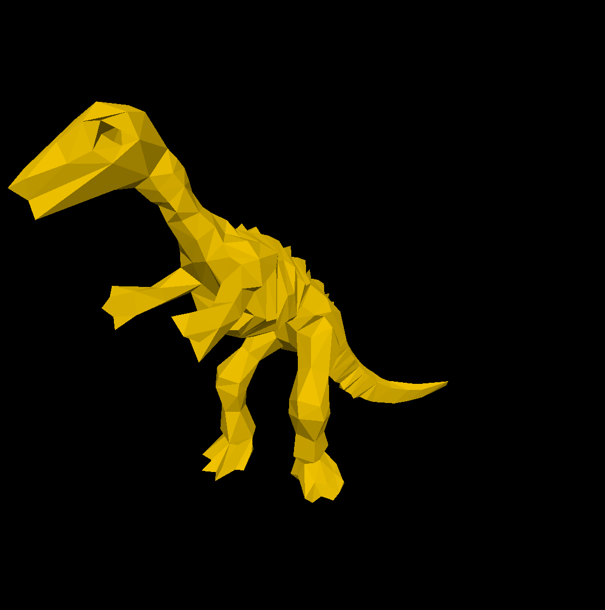

## Task 4: Mesh Smoothing

遍历所有的点，计算邻居位置的加权平均$v^*$，并与该点原来位置再次加权平均。

当使用Uniform Laplacian时，遍历所有的邻居点，取坐标均值。

当使用Cotangent Laplacian时，先用余弦定理计算$\cos (\alpha_{ij})$，再计算$\cot (\alpha_{ij}) = \cfrac{\cos (\alpha_{ij})}{\sqrt{(1-(\cos (\alpha_{ij}))^2)}}$。此时通过遍历所有相邻的面会比遍历邻居点更方便。

在测试函数时发现mesh中有共线的三个点构成面的情况存在，故对得到的$\cos (\alpha_{ij})$做了判断，若该三角形中有一个角度的余弦值超过阈值（设定为$\pm 0.99$），则该面将被忽略。

函数实现的效果如下（迭代次数均为10，平滑程度均为0.7）。

`block.obj`，使用Uniform Laplacian。

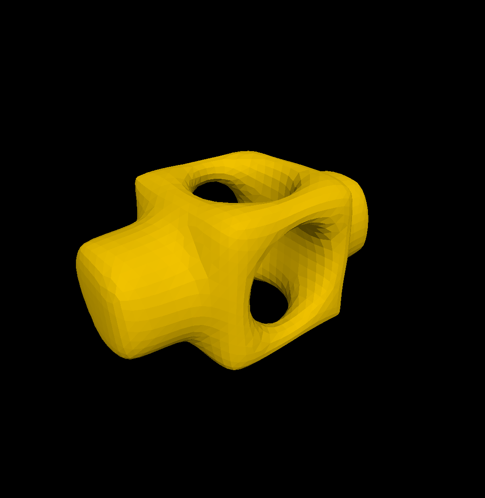

`block.obj`，使用Cotangent Laplacian。

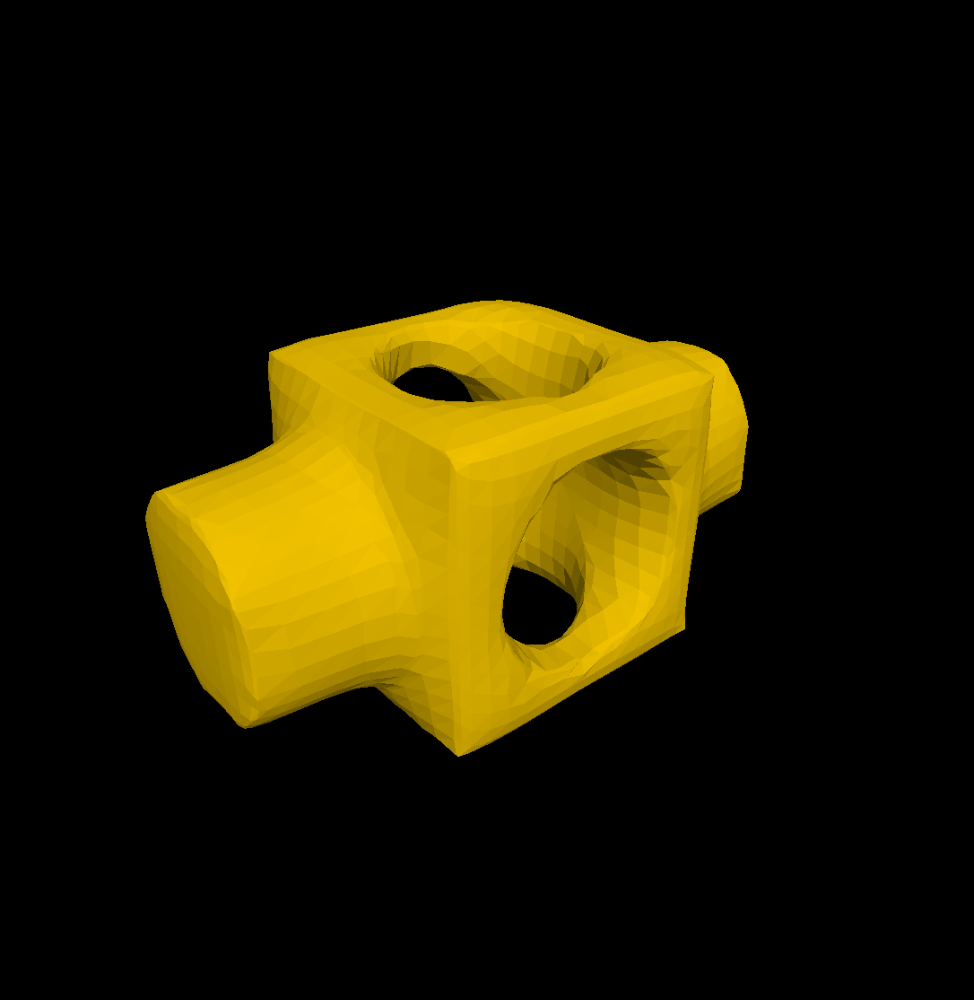

`dinosaur.obj`，使用Uniform Laplacian。

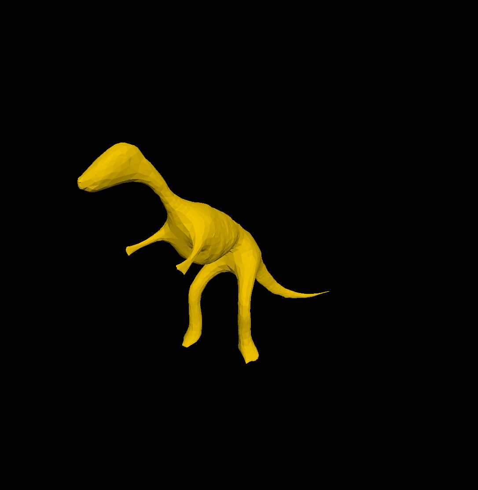

`dinosaur.obj`，使用Cotangent Laplacian。

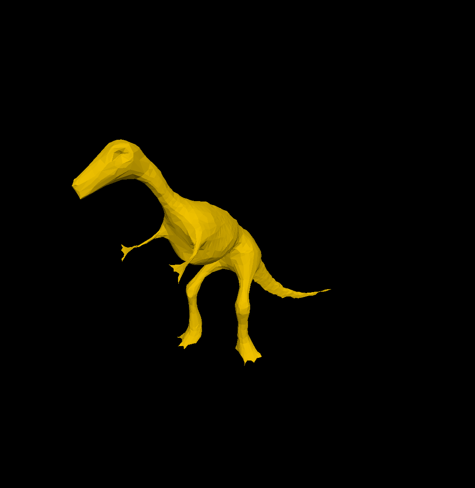

## Task 5: Marching Cubes

遍历每个网格。

**Step 1** 计算各个顶点的$state_i=
\left\{
    \begin{array}{ll}
    1, & sdf(v_i)\geq 0\\   
    0, & sdf(v_i) < 0
    \end{array}
\right.$，和网格的$state = \displaystyle\sum_{i=0}^{7}state_i << i$，（代码中采用异或）利用`c_EdgeStateTable`查询与mesh相交的边。

**Step 2** 计算在每条被相交的边上的交点位置$v^* = \lambda v_{from}+(1-\lambda) v_{to}$，其中$\lambda = \cfrac{-sdf(v_{to})}{sdf(v_{from})-sdf(v_{to})}$，若$sdf(v_{from})=sdf(v_{to})$，则取$\lambda = 0.5$。

**Step 3** 根据各个顶点的状态，在`c_EdgeOrdsTable`中查询需要连接的三角形并连接各个面。

函数实现的效果如下。

球形隐式表面，`Resolution`为30。

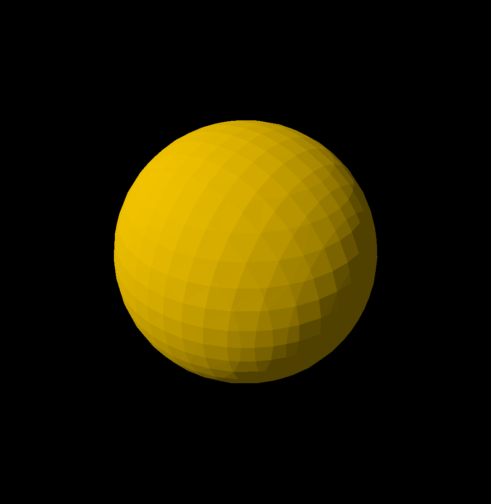

环形隐式表面，`Resolution`为70。

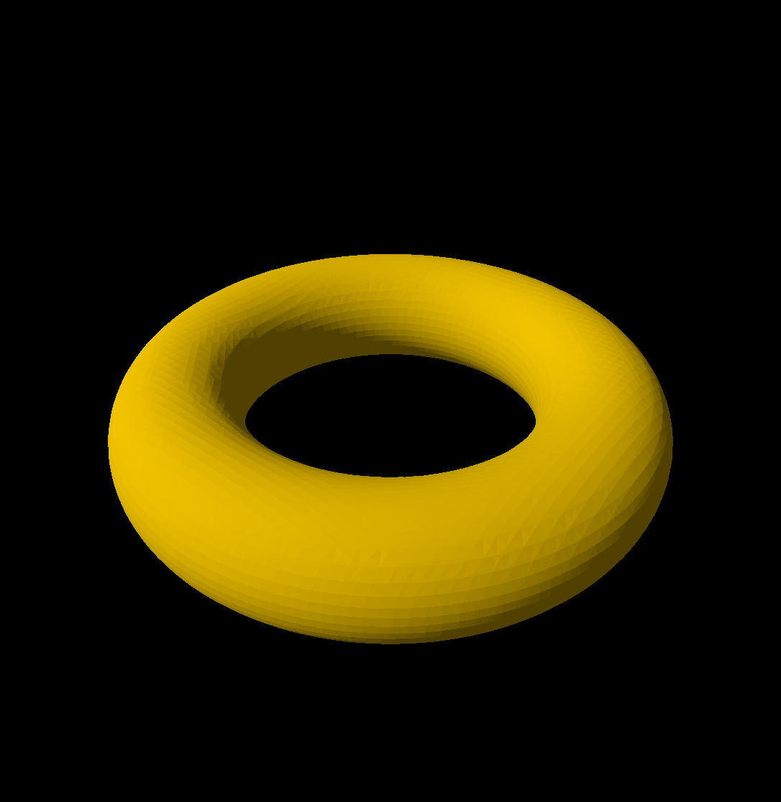
