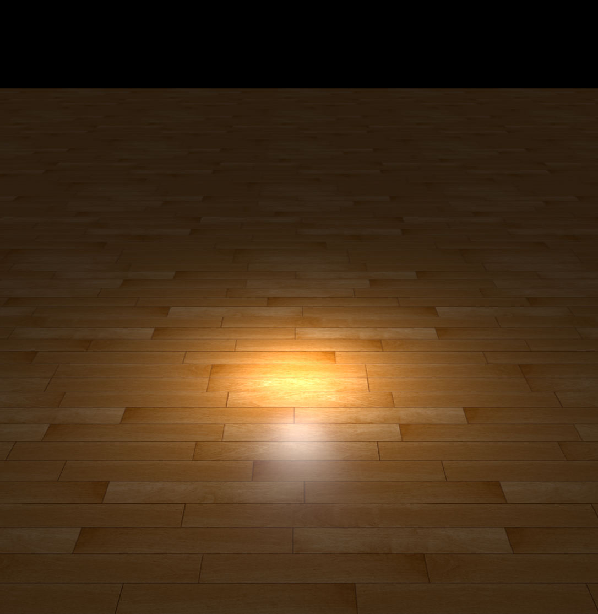

# Lab 3 Rendering

## Task 1: Phong Illumination

#### 实现思路与效果

(Blinn-)Phong光照由环境光、漫反射光和高光三部分组成，在`shade()`中主要实现后面两个部分。

漫反射光强度 = 表面颜色 × 入射光强度 × 光与平面所成夹角的余弦值。

在Phong模型中，高光强度 = 高光颜色 × 入射光强度 × 反射光与视线所成夹角的余弦值$^{光泽度}$。Phong模型的渲染效果如下。

在Blinn-Phong模型中，高光强度 = 高光颜色 × 入射光强度 × 半程向量与表面法向所成夹角的余弦值$^{光泽度}$。其中半程向量的方向为视线与入射光之和的方向。Blinn-Phong模型的渲染效果如下。

#### 问题回答

Q1. 顶点着色器和片段着色器的关系是什么样的？顶点着色器中的输出变量是如何传递到片段着色器当中的？

A1. 关系：顶点着色器设置顶点的颜色，片段着色器通过在顶点间进行插值设置像素的颜色。

传递：在发送方通过`out`生命一个输出，在接收方通过`in`声明一个输入，当二者的类型与名字都一样时，两个变量便会被连接到一起，实现数据的传递。

Q2. 代码中的 `if (diffuseFactor.a < .2) discard;` 这行语句，作用是什么？为什么不能用 `if (diffuseFactor.a == 0.) discard;` 代替？

A2. 作用：对表面透明度足够高的物体，不进行Phong Illumination。0.2在此处作为透明度的阈值，若判断条件改成`== 0.`，一方面对透明度较高但仍未达0的物体依然进行Phong渲染会导致结果不符合实际，另一方面这些渲染的过程会加大计算量，增加整体渲染时间；此外，对浮点数直接写`==`符号也会有计算精度上的问题。

#### 凹凸映射

参考了[这篇文档](https://gamedev.stackexchange.com/questions/174642/how-to-write-a-shader-that-only-uses-a-bump-map-without-a-normal-map)的实现方法。效果如下。

## Task 2: Environment Mapping

计算视线到物体表面的单位向量`I`和`I`经物体表面反射后的向量`R`，利用`R`从天空盒贴图中采样。

对`teapot`和`bunny`两个不同的样例，天空盒的大小似乎需要手动调整以获得更好的效果。

`teapot`效果如下，天空盒的大小(齐次坐标系的`w`)为0.01。

`bunny`效果如下，天空盒的大小(齐次坐标系的`w`)为0.25。

## Task 3: Non-Photorealistic Rendering

#### 实现思路与效果

$k_\mathrm{cool}=\cfrac{1+\hat{\boldsymbol{l}}\cdot\hat{\boldsymbol{n}}}{2}$为冷色的权重，$k_\mathrm{warm} = 1-k_\mathrm{cool}$为暖色的权重。

对颜色直接求加权和效果如下。

若限制$k_\mathrm{cool}$只取离散值，效果如下。

#### 问题回答

Q1. 代码中是如何分别渲染模型的反面和正面的？

A1. 反面：渲染轮廓线；正面：渲染表面色彩。

Q2. `npr-line.vert` 中为什么不简单将每个顶点在世界坐标中沿着法向移动一些距离来实现轮廓线的渲染？这样会导致什么问题？

A2. 坐标变换不保持长度，若直接在世界坐标中沿法向移动将使得实际显示效果中不同位置的轮廓线粗细不同。

## Task 4: Shadow Mapping

#### 实现思路与效果

有向光源：直接计算光源方向上的深度。有向光源渲染效果如下。

点光源：先求出光源到渲染位置的方向向量，再计算这个方向上的深度。点光源渲染效果如下。

#### 问题回答

Q1. 想要得到正确的深度，有向光源和点光源应该分别使用什么样的投影矩阵计算深度贴图？

A1. 有向光源：正交投影；点光源：透视投影。

Q2. 为什么 `phong-shadow.vert` 和 `phong-shadow.frag` 中没有计算像素深度，但是能够得到正确的深度值？

A2. 正交投影保持平行性。

## Task 5: Whitted-Style Ray Tracing

#### 实现思路与效果

**Step 1. Ray-Triangle Intersection**

求解方程组$o+td = p_1+u(p_2-p_1)+v(p_3-p_1)$，也即$\begin{pmatrix}p_1-p_2 & p_1-p_3 & d\end{pmatrix}\begin{pmatrix} u \\ v \\ t \end{pmatrix} = p_1-o$。

**Step 2. Whitted Style Ray Tracing**

使用Phong Illumination实现无阴影处的渲染，效果如下。

**Step 3. Shadow Ray**

对点光源，通过渲染点和光源连线上是否有物体判断是否被遮挡。

对平行光源，通过渲染点沿光线逆方向是否有物体判断是否被遮挡。

实现阴影后的效果如下。

#### 问题回答

Q. 光线追踪和光栅化的渲染结果有何异同？如何理解这种结果？

A. 同：均能实现颜色渲染和阴影渲染。

异：光线追踪能实现反射、透明等更复杂的结果。

解释：光栅化将物体投影到像素上，并将预处理的深度等信息映射像素点进行渲染，针对表面特征、透明度、投影等比较复杂或者依赖于物体间相对位置的情况，缺乏可靠的预处理手段，所以光栅化很难实现相应的效果。而光线追踪通过将像素投影到物体上，能在物体空间中进行光线路径和相应效果的计算，所以能处理更复杂的情况，但是相应的渲染时间也大大延长。