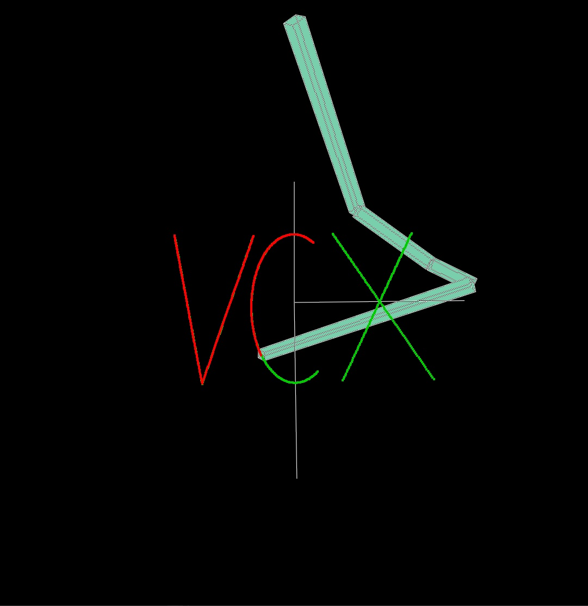
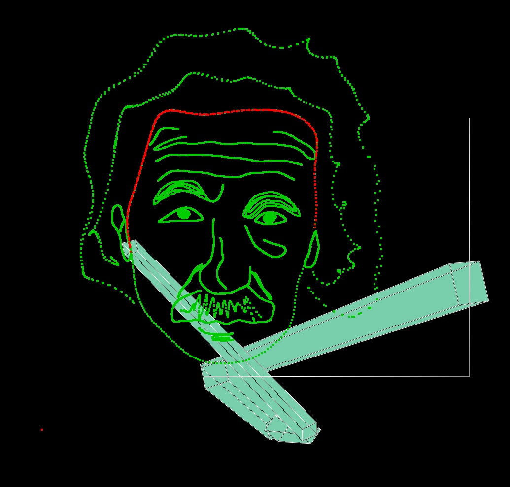
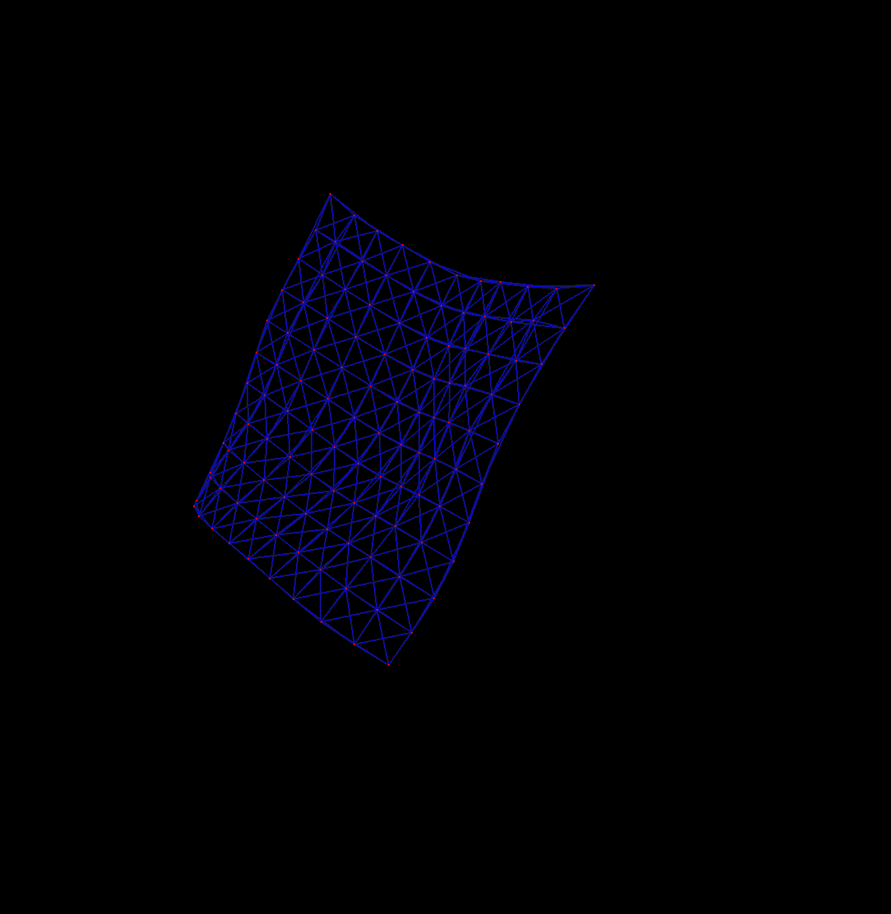

# Lab 4 Animation

## Task 1: Inverse Kinematics

#### 实现思路与结果

**Sub-Task 1: Forward Kinematics** 关节的全局旋转为相对父关节旋转与父关节全局旋转之积。

关节的全局位置为父关节的全局位置加上相对父关节的偏移量，偏移量为初始偏移量经过相对父关节的旋转。

**Sub-Task 2: CCD IK** 在一个Iteration内，遍历所有非末端关节，利用(关节到末端关节)和(关节到目标)的两个向量计算相应的旋转，并将该旋转应用到关节上。

**Sub-Task 3: FABR IK** 在一个Iteration内，首先逆向遍历所有关节，将$p_n$置于$\mathrm{target}$处，记为$p_n'$，计算$dir = \mathrm{norm}(\overrightarrow{p_n'p_{n-1}})$，将$p_{n-1}$置于$p_{n-1}' = p_n' + dir * ||p_np_{n-1}||$处，直到将$p_0$置于$p_0'$处；在进行正向遍历，将$p_0'$置于$p_0'' = p_0$处，进行类似的处理，直到将$p_n'$置于$p_n''$处。不断迭代至迭代结束或所得的$p_n$与$\mathrm{target}$足够接近。

**Sub-Task 4: Customized Curve** 效果如下。

**Sub-Task 4.1** 设置threshold，当相邻两个点间距过大时在其中进行插值；当响铃两个点间距过小时舍弃其中一个。效果如下。

#### 问题回答

Q1. 如果目标位置太远，无法到达，IK 结果会怎样？

A1. 将形成从根关节到目标位置的直线。

Q2. 比较 CCD IK 和 FABR IK 所需要的迭代次数。

A2. FABR IK 迭代次数少得多。

Q3. 由于 IK 是多解问题，在个别情况下，会出现前后两帧关节旋转抖动的情况。怎样避免或是缓解这种情况？

A3. 在多解中寻找与上一个情况最相近的解。

## Task 2: Mass-Spring System

（实现时未考虑原有的`Damping`，也即力只有重力和弹簧的胡克弹力）

公式推导参考论文[Fast Simulation of Mass-Spring Systems](http://tiantianliu.cn/papers/liu13fast/liu13fast.pdf)。

设系统包含$n$个节点，将这$n$个节点的位置用${q} \in \mathbb{R}^{3n}$表示。则隐式欧拉法的方程为
$$\begin{align}
{v}_{t+\Delta t} &= {v}_{t} + \Delta t {M}^{-1}{f}({q}_{t+\Delta t}) \\
{q}_{t + \Delta t} &= {q}_{t} + \Delta t {v}_{t+\Delta t}
\end{align}$$

其中${M} = \mathrm{diag}\{m_1,\cdots,m_n\} \otimes {I}_{3\times 3}$。记${x} = {q}_{t+\Delta t}$，${y} = {q}_{t} + \Delta t {v}_{t}$，整理得
$$
{M(x-y)} = \Delta t^2 {f(x)}
$$
设系统能量为$E = E_{\mathrm{ext}}+E_{\mathrm{spring}}$，则${f(x)} = - \nabla E({x})$，令
$$
g({x}) = \cfrac{1}{2}{(x-y)^{T}M(x-y)} + \Delta t^2 E({x})
$$则${M(x-y)} = \Delta t^2 {f(x)}$等价于$\nabla_{{x}}g({x}) = {0}$，也即所求的${x}$是$g({x})$的极值点。将$g({x})$化简
$$
\begin{aligned}
g({x}) &= 
\cfrac{1}{2}{(x-y)^{T}M(x-y)} + \Delta t^2(E_{\mathrm{ext}}+E_{\mathrm{spring}}) \\
&= \cfrac{1}{2}{(x-y)^{T}M(x-y)} - \Delta t^2 {f}_{\mathrm{ext}}^{{T}}{x} + \Delta t^2\sum_{i=1}^{s}\cfrac{k_i}{2}(||{p}_{i,1} - {p}_{i,2}|| -r_{i})^2
\end{aligned}
$$其中$s$为弹簧数目，${p}_{i,1}$和${p}_{i,2}$为第$i$个弹簧两端的质点的位置，$r_i$为弹簧原长度。而对于$r \geq 0$，有$(||{p}_1-{p}_2|| - r)^2 = \min\limits_{||{d}||=r}||({p}_1-{p}_2)-{d}||^2$，在${d} = \cfrac{{p}_1-{p}_2}{||{p}_1-{p}_2||}r$时取到极值，故
$$
\begin{aligned}
g({x}) &= 
\cfrac{1}{2}{(x-y)^{T}M(x-y)} - \Delta t^2 {f}_{\mathrm{ext}}^{{T}}{x} + \Delta t^2\sum_{i=1}^{s}\cfrac{k_i}{2}\min_{{d}_i}||{p}_{i,1} - {p}_{i,2}-{d}_i||^2\\
&= \cfrac{1}{2}{x^{T}}({M}+\Delta t^2{L}){x} - \Delta t^2{x^{T}Jd}-{x^{T}}({My} + \Delta t^2{f}_{\mathrm{ext}}) + \mathrm{Constant}
\end{aligned}
$$其中
$$
\begin{aligned}
&{L} = \left(\sum_{i=1}^{s}k_i{A}_i{A}_i^{{T}}\right)\otimes {I}_{3\times 3} \in \mathbb{R}^{3n\times 3n}, &&{J} = \left(\sum_{i=1}^{s}k_i{A}_i{S}_i^{{T}}\right)\otimes{I}_{3\times 3} \in \mathbb{R}^{3n \times 3s} \\
&{A}_{i,j} = {\begin{cases}
    1, & j=i_{1} \\ -1, & j=i_{2} \\ 0, &\mathrm{otherwise}
\end{cases}}
, \quad {A}_i \in \mathbb{R}^{n}, &&{S}_{i,j} = \delta_{i,j},\quad  {S}_i \in \mathbb{R}^{s} \\
&{d} = ({d}_1, \cdots, {d}_s) \in \mathbb{R}^{3s}, && {d}_i = \cfrac{{p}_{i,1} - {p}_{i,2}}{||{p}_{i,1} - {p}_{i,2}||}r_i
\end{aligned}
$$于是
$$
\begin{aligned}
    \nabla_{{x}}g({x}) = {0} \iff ({M}+ \Delta t^2{L}){x} = \Delta t^2 {Jd} + {My} + \Delta t^2{f}_{\mathrm{ext}} \iff {Qx = b}
\end{aligned}
$$只需解出${x}$即得各质点新的位置。

最终实现的单帧效果如下。

