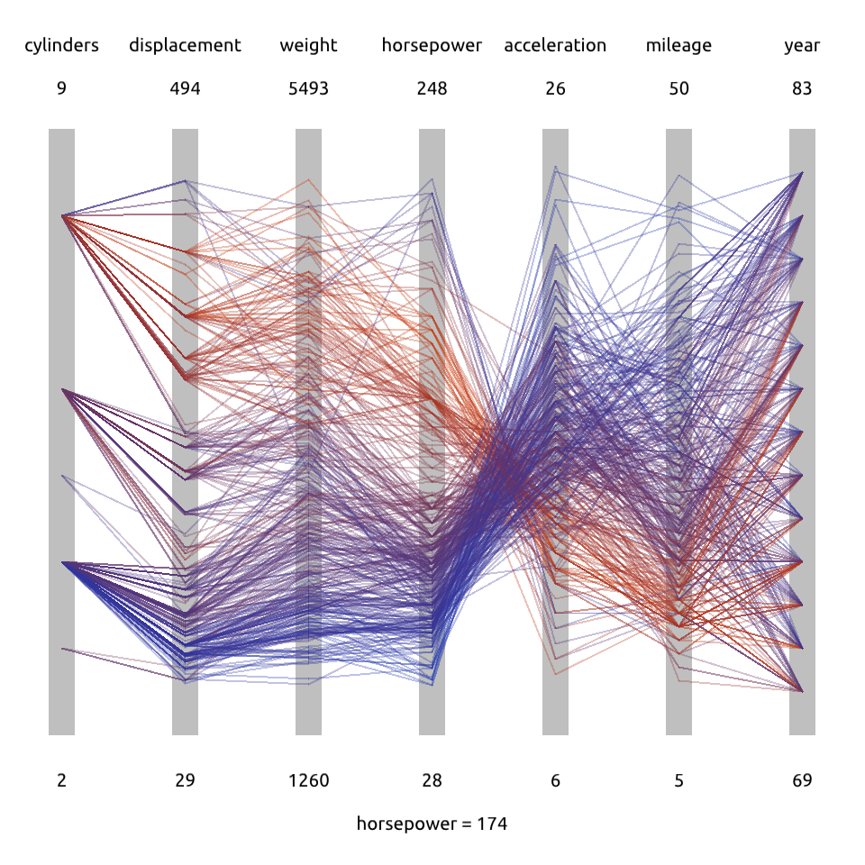

# Lab 5 Visualization

## Task 1: Parallel Coordinates Visualization

实现结果如下。

**可视化方面**

图中所展示的数据包括

- 字段名
- 字段值的范围（在原有最大最小值的基础上向外延拓10%）
- 平行坐标可视化的结果（折线+颜色，颜色的含义将在交互部分中说明）
  
**交互方面**

通过鼠标点击坐标轴获取相应的坐标值，（如图中鼠标点击`horsepower`坐标轴的中间偏上部分，底部显示`horsepower=174`），并将各折线染色。折线的对应属性越接近选择的属性（如图中`horsepower`越接近`174`），则相应的颜色越偏向红色，否则越偏向蓝色。

若鼠标点击位置不在坐标轴内，则不进行更新。